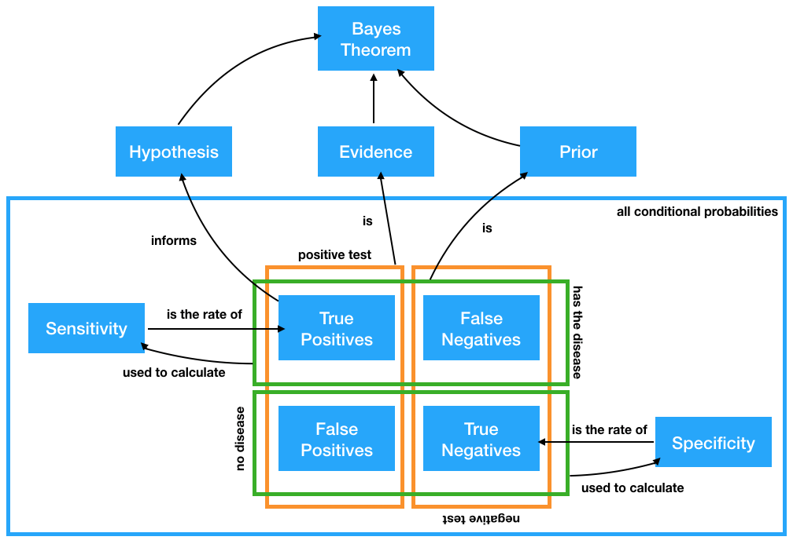

# The Learner Persona

```{r, echo = FALSE, warning = FALSE, message = FALSE, out.width = "30%"}
library(tidyverse)
library(countdown)

```

Dillon is a pre-med student at NC State. He’s committed to major in biology and loves the hands-on work he gets to do shadowing scientists in the lab. He's very good at memorizing facts, especially when it comes to anatomy, but to apply to medical school, he has to complete a few math courses. He decides to start with statistics as his friends say it's an easy way to get an A. Unfortunately, they don't know he hates math and has not done much math beyond basic algebra since graduating from high school. Nevertheless, he knows he will need to develop some kind of statistical literacy to understand what a p-value is, so he signed up for introductory statistics. He hopes that he has a nice teacher.


---
class: inverse, center, middle

# My [Favorite](https://askgoodquestions.blog/) Theorem

---
background-image: url("images/elisa.png")

```{r setup, include=FALSE}
options(htmltools.dir.version = FALSE)
```

# The [ELISA](https://www.jstor.org/stable/2245749?seq=1#metadata_info_tab_contents) Test

---

# The [ELISA](https://www.jstor.org/stable/2245749?seq=1#metadata_info_tab_contents) Test

- Developed in mid 1980s to screen blood donations

--

- Test gives a correct positive result for $97.7\%$ of blood samples infected with HIV

--

> **Sensitivity** of the test is 97.7%.

--

- Test gives a correct negative result for $92.6\%$ of blood samples not infected with HIV

--

> **Specificity** of the test is 92.6%.

--

- Only $0.5\%$ of Americans have HIV

---

class: inverse, center, middle

# If a patient tests positive, what is the probability the patient has HIV?

---

# Suppose our world = 1 million people...

```{r, echo = FALSE}
tab <- tibble(
  `_` = c("Infected", "Not Infected", "Total"),
  `Positive Blood Test` = c("?", "?",  "?"), 
  `Negative Blood Test` = c("?", "?",  "?"), 
  `Total` = c("?",  "?", "1,000,000"))  %>%
  knitr::kable('html') %>%
  kableExtra::kable_styling(full_width = TRUE, bootstrap_options = "basic")
tab
```

---

# Suppose our world = 1 million people...

```{r, echo = FALSE}
tab <- tibble(
  `_` = c("Infected", "Not Infected", "Total"),
  `Positive Blood Test` = c("[3]", "[6]",  "[7]"), 
  `Negative Blood Test` = c("[4]", "[5]",  "[8]"), 
  `Total` = c("[1]",  "[2]", "1,000,000"))  %>%
  knitr::kable('html') %>%
  kableExtra::kable_styling(full_width = TRUE, bootstrap_options = "basic")
tab
```

---

# Suppose our world = 1 million people...

```{r, echo = FALSE}
tab <- tibble(
  `_` = c("Infected", "Not Infected", "Total"),
  `Positive Blood Test` = c("[3]", "[6]",  "[7]"), 
  `Negative Blood Test` = c("[4]", "[5]",  "[8]"), 
  `Total` = c("[1]",  "[2]", "1,000,000"))  %>%
  knitr::kable('html') %>%
  kableExtra::kable_styling(full_width = TRUE, bootstrap_options = "basic")
tab
```

- Test gives a correct positive result for $97.7\%$ of blood samples infected with HIV 

--

> What is this known as?

---

# Suppose our world = 1 million people...

```{r, echo = FALSE}
tab <- tibble(
  `_` = c("Infected", "Not Infected", "Total"),
  `Positive Blood Test` = c("[3]", "[6]",  "[7]"), 
  `Negative Blood Test` = c("[4]", "[5]",  "[8]"), 
  `Total` = c("[1]",  "[2]", "1,000,000"))  %>%
  knitr::kable('html') %>%
  kableExtra::kable_styling(full_width = TRUE, bootstrap_options = "basic")
tab
```

- Test gives a correct positive result for $97.7\%$ of blood samples infected with HIV 


> What is this known as? **Sensitivity**

--

- Test gives a correct negative result for $92.6\%$ of blood samples not infected with HIV

--

> What is this known as?

---

# Suppose our world = 1 million people...

```{r, echo = FALSE}
tab <- tibble(
  `_` = c("Infected", "Not Infected", "Total"),
  `Positive Blood Test` = c("[3]", "[6]",  "[7]"), 
  `Negative Blood Test` = c("[4]", "[5]",  "[8]"), 
  `Total` = c("[1]",  "[2]", "1,000,000"))  %>%
  knitr::kable('html') %>%
  kableExtra::kable_styling(full_width = TRUE, bootstrap_options = "basic")
tab
```

- Test gives a correct positive result for $97.7\%$ of blood samples infected with HIV 


> What is this known as? **Sensitivity**


- Test gives a correct negative result for $92.6\%$ of blood samples not infected with HIV


> What is this known as? **Specificity** 

--

- Only $0.5\%$ of Americans have HIV

---

# Suppose our world = 1 million people...

```{r, echo = FALSE}
tab <- tibble(
  `_` = c("Infected", "Not Infected", "Total"),
  `Positive Blood Test` = c("[3]", "[6]",  "[7]"), 
  `Negative Blood Test` = c("[4]", "[5]",  "[8]"), 
  `Total` = c("[1]",  "[2]", "1,000,000"))  %>%
  knitr::kable('html') %>%
  kableExtra::kable_styling(full_width = TRUE, bootstrap_options = "basic")
tab
```

- **Sensitivity**: Test gives a correct positive result for $97.7\%$ of blood samples infected

- **Specificity**: Test gives a correct negative result for $92.6\%$ of blood samples not infected

- Only $0.5\%$ of Americans have HIV

### Let's fill in [1] together:

## 1,000,000 people x `_____`

---

# Suppose our world = 1 million people...

```{r, echo = FALSE}
tab <- tibble(
  `_` = c("Infected", "Not Infected", "Total"),
  `Positive Blood Test` = c("[3]", "[6]",  "[7]"), 
  `Negative Blood Test` = c("[4]", "[5]",  "[8]"), 
  `Total` = c("5,000",  "[2]", "1,000,000"))  %>%
  knitr::kable('html') %>%
  kableExtra::kable_styling(full_width = TRUE, bootstrap_options = "basic")
tab
```

- **Sensitivity**: Test gives a correct positive result for $97.7\%$ of blood samples infected

- **Specificity**: Test gives a correct negative result for $92.6\%$ of blood samples not infected

- Only $0.5\%$ of Americans have HIV

### Let's fill in [1] together:

## 1,000,000 people x 0.005 = 5,000

---

# Suppose our world = 1 million people...

```{r, echo = FALSE}
tab <- tibble(
  `_` = c("Infected", "Not Infected", "Total"),
  `Positive Blood Test` = c("[3]", "[6]",  "[7]"), 
  `Negative Blood Test` = c("[4]", "[5]",  "[8]"), 
  `Total` = c("5,000",  "[2]", "1,000,000"))  %>%
  knitr::kable('html') %>%
  kableExtra::kable_styling(full_width = TRUE, bootstrap_options = "basic")
tab
```

- **Sensitivity**: Test gives a correct positive result for $97.7\%$ of blood samples infected

- **Specificity**: Test gives a correct negative result for $92.6\%$ of blood samples not infected

- Only $0.5\%$ of Americans have HIV

### Let's fill in [2] together:

## `_____` - `_____` = `_____`

---

# Suppose our world = 1 million people...

```{r, echo = FALSE}
tab <- tibble(
  `_` = c("Infected", "Not Infected", "Total"),
  `Positive Blood Test` = c("[3]", "[6]",  "[7]"), 
  `Negative Blood Test` = c("[4]", "[5]",  "[8]"), 
  `Total` = c("5,000",  "995,000", "1,000,000"))  %>%
  knitr::kable('html') %>%
  kableExtra::kable_styling(full_width = TRUE, bootstrap_options = "basic")
tab
```

- **Sensitivity**: Test gives a correct positive result for $97.7\%$ of blood samples infected

- **Specificity**: Test gives a correct negative result for $92.6\%$ of blood samples not infected

- Only $0.5\%$ of Americans have HIV

### Let's fill in [2] together:

## 1,000,000 - 5,000 = 995,000

---

# Suppose our world = 1 million people...

```{r, echo = FALSE}
tab <- tibble(
  `_` = c("Infected", "Not Infected", "Total"),
  `Positive Blood Test` = c("[3]", "[6]",  "[7]"), 
  `Negative Blood Test` = c("[4]", "[5]",  "[8]"), 
  `Total` = c("5,000",  "995,000", "1,000,000"))  %>%
  knitr::kable('html') %>%
  kableExtra::kable_styling(full_width = TRUE, bootstrap_options = "basic")
tab
```

- **Sensitivity**: Test gives a correct positive result for $97.7\%$ of blood samples infected

- **Specificity**: Test gives a correct negative result for $92.6\%$ of blood samples not infected

- Only $0.5\%$ of Americans have HIV

### Your turn!

`r countdown(minutes = 4)`

---

# Suppose our world = 1 million people...

```{r, echo = FALSE}
tab <- tibble(
  `_` = c("Infected", "Not Infected", "Total"),
  `Positive Blood Test` = c("[3]", "[6]",  "[7]"), 
  `Negative Blood Test` = c("[4]", "[5]",  "[8]"), 
  `Total` = c("5,000",  "995,000", "1,000,000"))  %>%
  knitr::kable('html') %>%
  kableExtra::kable_styling(full_width = TRUE, bootstrap_options = "basic")
tab
```

- **Sensitivity**: Test gives a correct positive result for $97.7\%$ of blood samples infected

- **Specificity**: Test gives a correct negative result for $92.6\%$ of blood samples not infected

- Only $0.5\%$ of Americans have HIV

## [3] `_____` x 5,000 = `_____` 

---

# Suppose our world = 1 million people...

```{r, echo = FALSE}
tab <- tibble(
  `_` = c("Infected", "Not Infected", "Total"),
  `Positive Blood Test` = c("4,885", "[6]",  "[7]"), 
  `Negative Blood Test` = c("[4]", "[5]",  "[8]"), 
  `Total` = c("5,000",  "995,000", "1,000,000"))  %>%
  knitr::kable('html') %>%
  kableExtra::kable_styling(full_width = TRUE, bootstrap_options = "basic")
tab
```

- **Sensitivity**: Test gives a correct positive result for $97.7\%$ of blood samples infected

- **Specificity**: Test gives a correct negative result for $92.6\%$ of blood samples not infected

- Only $0.5\%$ of Americans have HIV

## [3] **Sensitivity** x 5,000 = .977 x 5,000 = 4,885 

--

## Also known as, the number of **True Positives**

---

# Suppose our world = 1 million people...

```{r, echo = FALSE}
tab <- tibble(
  `_` = c("Infected", "Not Infected", "Total"),
  `Positive Blood Test` = c("4,885", "[6]",  "[7]"), 
  `Negative Blood Test` = c("115", "[5]",  "[8]"), 
  `Total` = c("5,000",  "995,000", "1,000,000"))  %>%
  knitr::kable('html') %>%
  kableExtra::kable_styling(full_width = TRUE, bootstrap_options = "basic")
tab
```

- **Sensitivity**: Test gives a correct positive result for $97.7\%$ of blood samples infected

- **Specificity**: Test gives a correct negative result for $92.6\%$ of blood samples not infected

- Only $0.5\%$ of Americans have HIV

## [4] 5,000 - 4,885 = 115 

--

## Also known as, the number of **False Negatives**

---

# Suppose our world = 1 million people...

```{r, echo = FALSE}
tab <- tibble(
  `_` = c("Infected", "Not Infected", "Total"),
  `Positive Blood Test` = c("4,885", "[6]",  "[7]"), 
  `Negative Blood Test` = c("115", "[5]",  "[8]"), 
  `Total` = c("5,000",  "995,000", "1,000,000"))  %>%
  knitr::kable('html') %>%
  kableExtra::kable_styling(full_width = TRUE, bootstrap_options = "basic")
tab
```

- **Sensitivity**: Test gives a correct positive result for $97.7\%$ of blood samples infected

- **Specificity**: Test gives a correct negative result for $92.6\%$ of blood samples not infected

- Only $0.5\%$ of Americans have HIV

## [5] `_____` x 995,000 = `_____`

---

# Suppose our world = 1 million people...

```{r, echo = FALSE}
tab <- tibble(
  `_` = c("Infected", "Not Infected", "Total"),
  `Positive Blood Test` = c("4,885", "[6]",  "[7]"), 
  `Negative Blood Test` = c("115", "921,370",  "[8]"), 
  `Total` = c("5,000",  "995,000", "1,000,000"))  %>%
  knitr::kable('html') %>%
  kableExtra::kable_styling(full_width = TRUE, bootstrap_options = "basic")
tab
```

- **Sensitivity**: Test gives a correct positive result for $97.7\%$ of blood samples infected

- **Specificity**: Test gives a correct negative result for $92.6\%$ of blood samples not infected

- Only $0.5\%$ of Americans have HIV

## [5] **Specificity** x 995,000 = .926 * 995,000 = 921,370

--

## Also known as, the number of **True Negatives**

---

# Suppose our world = 1 million people...

```{r, echo = FALSE}
tab <- tibble(
  `_` = c("Infected", "Not Infected", "Total"),
  `Positive Blood Test` = c("4,885", "73,630",  "[7]"), 
  `Negative Blood Test` = c("115", "921,370",  "[8]"), 
  `Total` = c("5,000",  "995,000", "1,000,000"))  %>%
  knitr::kable('html') %>%
  kableExtra::kable_styling(full_width = TRUE, bootstrap_options = "basic")
tab
```

- **Sensitivity**: Test gives a correct positive result for $97.7\%$ of blood samples infected

- **Specificity**: Test gives a correct negative result for $92.6\%$ of blood samples not infected

- Only $0.5\%$ of Americans have HIV

## [6] 995,000 - 921,370 = 73,630

--

## Also known as, the number of **False Positives**

---

# Suppose our world = 1 million people...

```{r, echo = FALSE}
tab <- tibble(
  `_` = c("Infected", "Not Infected", "Total"),
  `Positive Blood Test` = c("4,885", "73,630",  "78,515"), 
  `Negative Blood Test` = c("115", "921,370",  "921,485"), 
  `Total` = c("5,000",  "995,000", "1,000,000"))  %>%
  knitr::kable('html') %>%
  kableExtra::kable_styling(full_width = TRUE, bootstrap_options = "basic")
tab
```

- **Sensitivity**: Test gives a correct positive result for $97.7\%$ of blood samples infected

- **Specificity**: Test gives a correct negative result for $92.6\%$ of blood samples not infected

- Only $0.5\%$ of Americans have HIV

## [7] 4,885 + 73,630 = 78,515

--

## [8] 115 + 921,370 = 921,485

---

class: inverse, center, middle

# If a patient tests positive, what is the probability the patient has HIV?

```{r, echo = FALSE}
tab <- tibble(
  `_` = c("Infected", "Not Infected", "Total"),
  `Positive Blood Test` = c("4,885", "73,630",  "78,515"), 
  `Negative Blood Test` = c("115", "921,370",  "921,485"), 
  `Total` = c("5,000",  "995,000", "1,000,000"))  %>%
  knitr::kable('html') %>%
  kableExtra::kable_styling("striped", full_width = TRUE) %>%
  kableExtra::row_spec(0:3, bold = T, color = "white", background = "#D7261E")
tab
```

---

class: inverse, center, middle

# $$\frac{4,885}{78,515} = 6.2\%$$

---

class: inverse, center, middle

# Does that make sense? 

---

# Some possible reasons

- A lot of **false positives**

--

- A lot of people are **not infected**

--

- There are two different conditional probabilities:

--

## <center>% of people with HIV given they tested positive</center>

## <center>vs</center>

## <center>% of people with a positive test given they have HIV</center>

---

class: inverse, center, middle

# Bayes Theorem

---

# Bayes Theorem

## $$P (HIV | +) = \frac{P(+ \text{ and } HIV)}{P(+)}$$

--

## $$6.2\% = \frac{\frac{4,985}{1,000,000}}{\frac{78,515}{1,000,000}}$$

---

# Bayes Theorem

## $$P (HIV | +) = \frac{P(+ \text{ and } HIV)}{P(+)}$$

--

## $$P (HIV | +) = \frac{P(+|HIV) P(HIV)}{P(+)}$$

--

## $$6.2\% = \frac{.977 * .005}{\frac{78,515}{1,000,000}}$$

---

# Bayes Theorem

We can generalize... 

--

## $$P (H | E) = \frac{P(E|H) P(H)}{P(E)}$$

---

class: inverse, center, middle

# What does that mean about the ELISA test?

---

# Is the ELISA test any good?

- It is still effective (compare 6.2% to 0.5%)

--

- A person with a positive test result is 12.4 times more likely to be infected with HIV than someone who has not been tested

---

```{r, echo = FALSE}

```

---

class: inverse, center, middle

# Thanks!

Slides created via the R package [**xaringan**](https://github.com/yihui/xaringan).

Lesson adapted from Allan Rossman's [**blog**](https://askgoodquestions.blog/).
